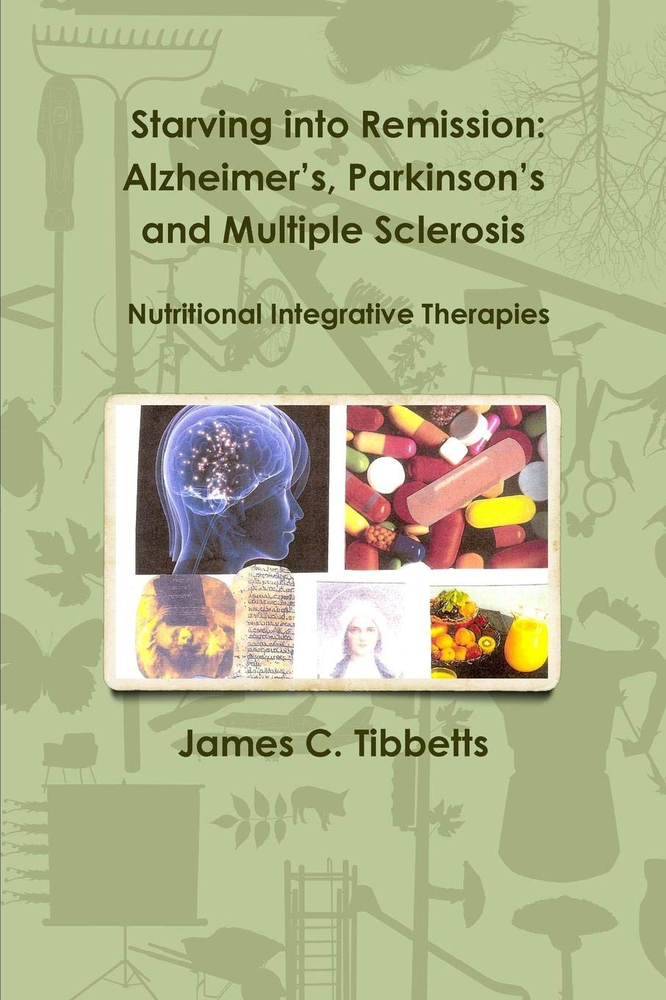

# Exploratory Parkinson's Project

A collaboration with Velador Associates and Cass Business School to explore the risk of dietary habits against Parkinson's Disease.
 
The following visualisation is inspired by Hans Roslings gapminder and based on the ideas presented in the book Starving into Remission.

# Data Source
Global burden of Disease or [Global Health Data Exchange](http://ghdx.healthdata.org/gbd-results-tool)

